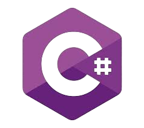

<h1 align="center"> Hi , I'm Angel</h1>

<h2 align="left">📚 | Education</h2>

As a Full Stack Developer committed to lifelong learning, I am on an active and ambitious academic journey. After earning my higher degree, I aim to share and apply my knowledge to create meaningful impact.
 

  <table style="margin-left: auto; margin-right: auto;">
    <tr>
      <td align="center" width=350px>
        
         
        <strong>DAM</strong> 09/22 - 06/24 
      </td>
      <td align="center" width=350px>
         
        <strong>IA & Big data</strong> 07/24 - 01/25 
      </td>
      <td align="center" width=350px>
        
         
        <strong>DAW</strong> 01/25 - 07/25 
      </td>
    </tr>
  </table>

  
## Programming Languages

## IDEs

## Databases

## Version Control

<!--
**yong12es/yong12es** is a ✨ _special_ ✨ repository because its `README.md` (this file) appears on your GitHub profile.

Here are some ideas to get you started:

- 🔭 I’m currently working on ...
- 🌱 I’m currently learning ...
- 👯 I’m looking to collaborate on ...
- 🤔 I’m looking for help with ...
- 💬 Ask me about ...
- 📫 How to reach me: ...
- 😄 Pronouns: ...
- ⚡ Fun fact: ...
-->
